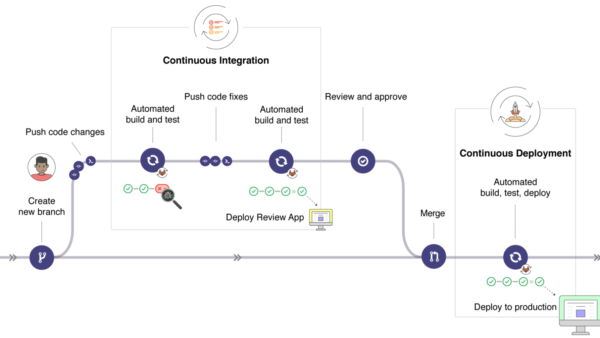

# What is Github Actions
It is platform, which help you, automatically check your code.
Abbreviation CI/CD translate as stand for continuous integration and continuous delivery or continuous deployment.

## Familiarization with CI/CD 
<a href="https://www.redhat.com/en/topics/devops/what-is-ci-cd" >Here you can learn how work CI/CD</a>

## How to build action file
<table>
  <thead>
    <tr>
      <th>First Header</th>
      <th>Second Header</th>
    </tr>
  </thead>
  <tbody>
    <tr>
      <td>Content Cell</td>
      <td>Content Cell</td>
    </tr>
    <tr>
      <td>Content Cell</td>
      <td>Content Cell</td>
    </tr>
  </tbody>
</table>