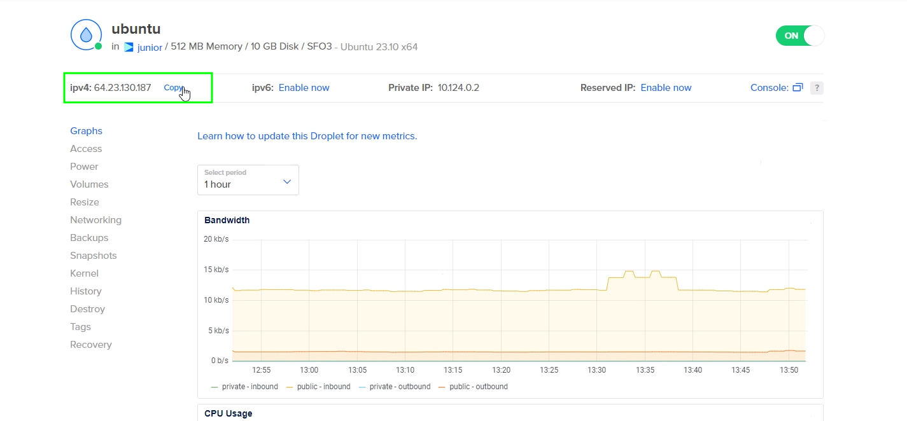
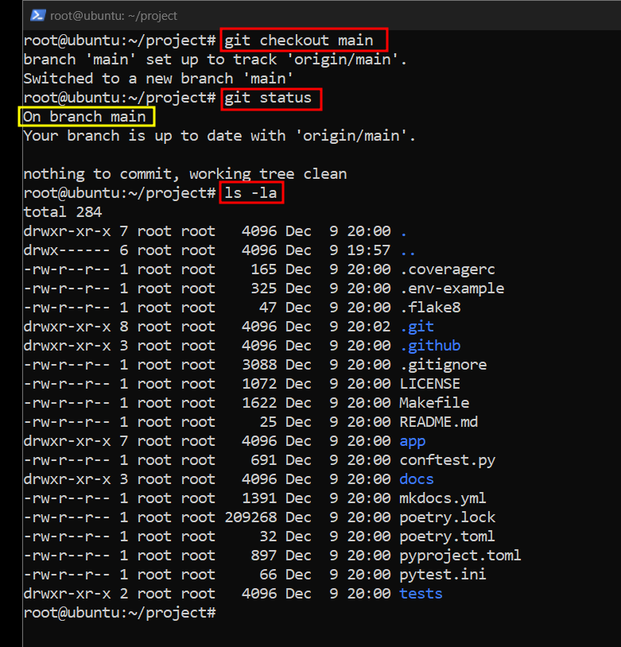

# Deploy

## Deploy by password
### Creation droplet




Creation droplet done

### Connection server by password

```
ssh root@
```

```commandline
ssh-keygen
```

```
cat /root/.ssh/id_rsa.pub
```
Open GitHub


Connect GitHub repository to server 


```commandline
ls
```
```commandline
mkdir project
```
```commandline
cd project
```
```commandline
git init
```
Pass your ssh from GitHub to this command
```
git remote add origin {ssh key}
```
```commandline
git status
```


```commandline
git checkout main
```
```commandline
ls -la
```
### Installation packages to server
In this step we need to make these installation commands
```commandline
sudo apt update
```
```commandline
sudo apt install python3-pip
```
```commandline
sudo apt install python3-dev
```
```commandline
sudo apt install python3-setuptools
```
```commandline
sudo apt install python3-poetry
```
```commandline
sudo apt install nginx
```
```commandline
poetry install
```


### Moving .env file to server directory


```
scp .\.env root@64.23.130.187:/root/project
```


### Starting the server


```commandline
source env/bin/activate
```


```
export PYTHONPATH="${PYTHONPATH}:/root/project"
```
```commandline
uvicorn app.main:app
```
Next we need to create file for nginx work
```
nano /etc/nginx/sites-available/{some name}
```
Example file


```
server {
    server_name {ipV4};
    location / {
        include proxy_params;
        proxy_pass http://127.0.0.1:8000;
    }
}
```

The following commands are in order

```
ln -s /etc/nginx/sites-available/{some name} /etc/nginx/sites-enabled/
```
```commandline
systemctl restart nginx
```
```commandline
systemctl status nginx.service
```
```commandline
gunicorn -w 4 -k uvicorn.workers.UvicornWorker app.main:app
```


```
nano /etc/systemd/system/{some name}.service
```

Example file

```
[Unit]
Description=Our project

[Service]
WorkingDirectory=/root/project
Environment="PATH=/root/project/.vevn/bin"
ExecStart=/root/project/.venv/bin/gunicorn -w 2 -k uvicorn.workers.UvicornWorker app.main:app

[Install]
WantedBy=multi-user.target
```

```commandline
systemctl daemon-reload
```
```
systemctl start {some name}
```
```
systemctl status {some name}
```