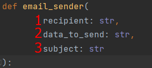

# How to create email sending
To begin with, in the "utils" folder, create a folder "email"

There should be a file with the same mailing function and a folder with html templates.
## Settings of .env
You also need to create a secure .env file.

Specify the following fields there:

`SMTP_SERVER=smtp.ukr.net
TOKEN_API=VQ24nhA9B0y3Nci0
USER=email@ukr.net`

Note that TOKEN_API and USER must be different from the code above but

SMTP_SERVER must be the same

TOKEN_API must be created using IMAP-access

## Python file with function
Minimum required list of packages:

We pass the following parameters to the function that will send letters:

1 - is a recipient of email

2 - is data for sending

3 - subject (title) of email

We transfer the value from .env to the variable in function

Function for reading template html and substitution in it our values(recipient, data_to_send, subject)

By analogy